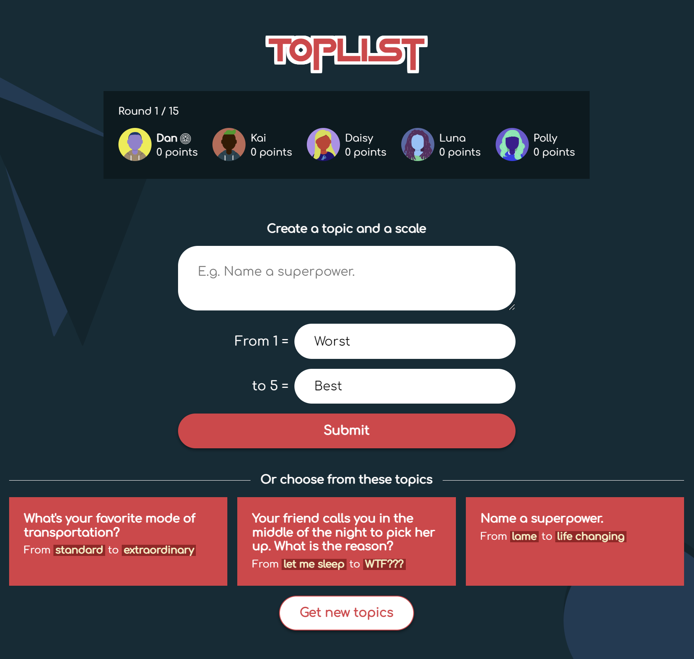
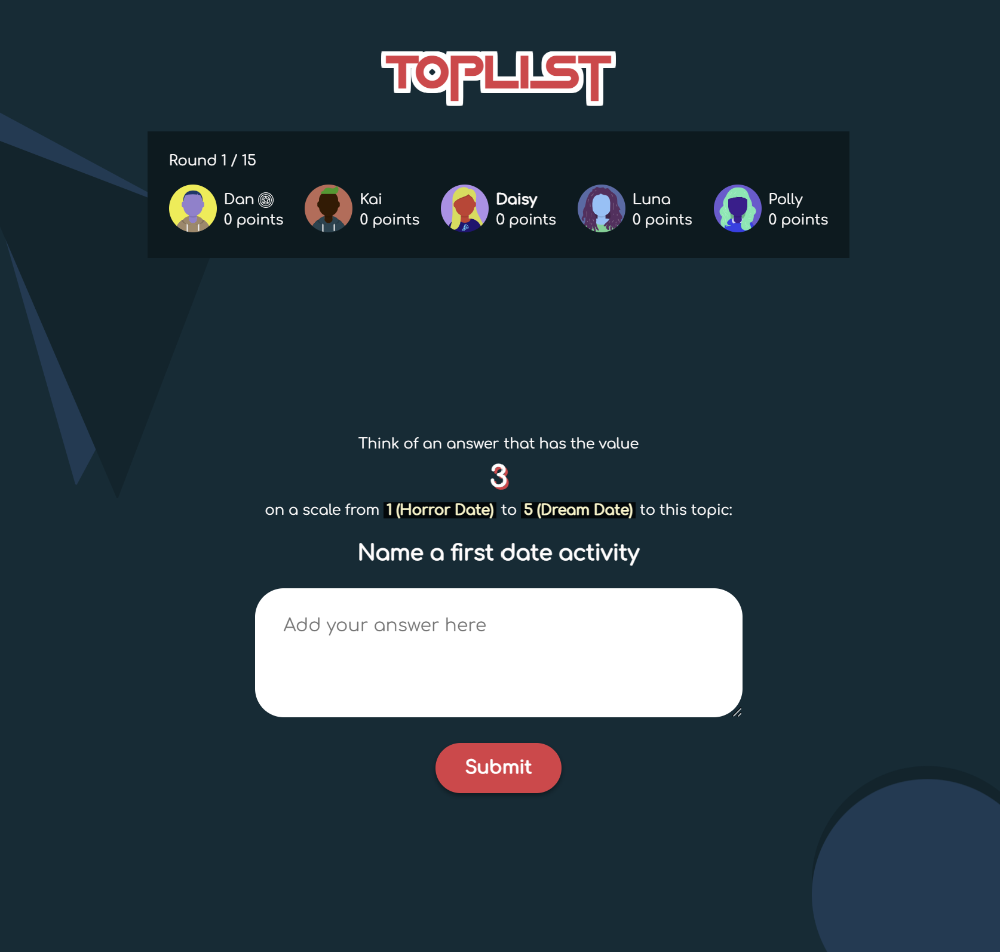
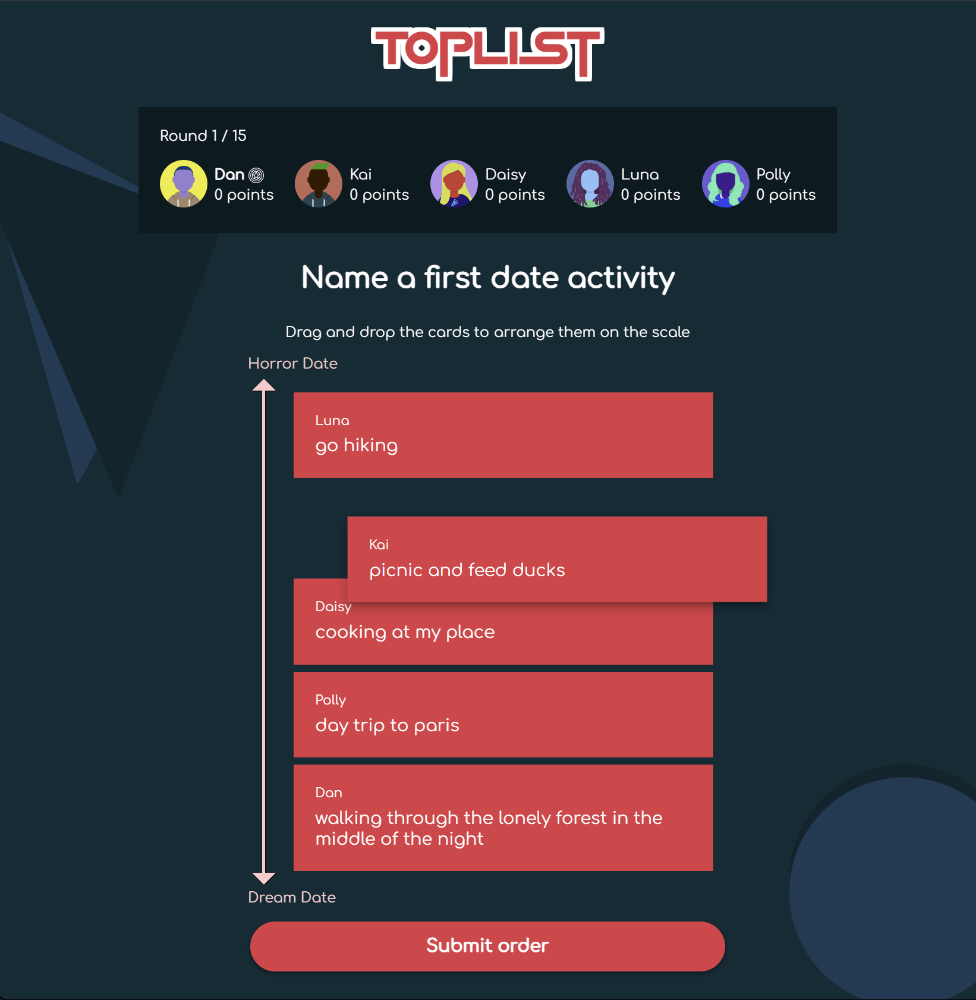

# Toplist online game

### 🎮 https://www.toplist-game.com 🎮

Toplist is a turn-based real-time party game. In each round another player is the
captain and thinks of a topic and a scale to which the players must find an answer matching their given value on the scale.
The captain then tries to find the correct order of the answers.

Toplist is a turn-based real-time party game for 4 to 10 players.
In each round another player is the captain and thinks of a topic (or chooses from a selection of example
  topics) to which the players must find an example according to their assigned value on a scale.
An example question could be "What is the perfect first date activity - from 1 (Horror date) to 10 (Dream date)?"
As soon as all players have submitted an answer, the captain starts to reveal them. Then he sorts the answers on the
  scale, with the aim of guessing the correct order.
  After that, the true values of the players are revealed.
  For each correctly assigned answer the captain receives one point (except their own answer) and the player who gave the answer also receives one point
  Afterwards, the role of the captain changes to the next player, whose turn it is to think up a topic.
The game ends as soon as each player has been captain as many times as defined in the number of runs at the
  beginning.

## dev

inside **client**: `npm install`

inside **server**: `npm install`

**root**: `npm run start:local` open under http://localhost:4200

## prod

**root**: `npm run build`, `npm run start` runs under http://localhost:3000